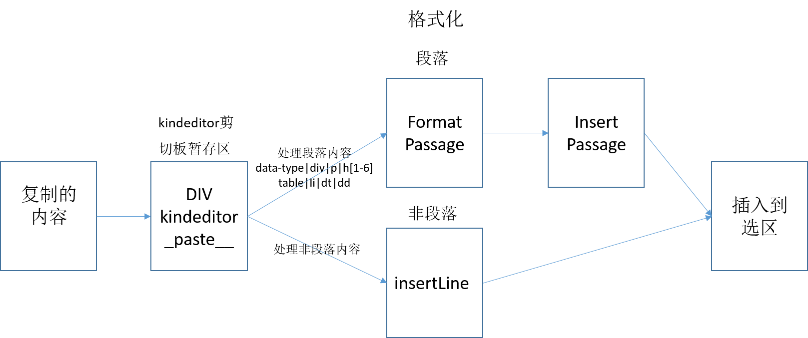

# 复制粘贴

## 简介

​	复制来源：编辑器外(word、Excel、ppt、wps、网页)，编辑器外

​	复制方式：多段复制、非段落复制

​	过程：粘贴——kindeditor剪切板暂存区——处理暂存区中的数据——插入到指定位置



## 函数结构

```javascript
pasteType : 1,

self.afterCreate(function() {
	var doc = self.edit.doc, cmd, bookmark, div, scrollPos,
			cls = '__kindeditor_paste__', pasting = false;
  	//第二步格式化拷贝内容，插入到选区
	function movePastedData() {
	      function formatPassage(html) {
		  }
		  function insertPassage(pasteHtml) {
		  }
		  function insertLine(html) {
		  }
		  if (self.pasteType === 1) {
		  }
		  self.insertHtml(pasteHtml, true);
	}
	//第一步编辑区绑定事件
	K(doc.body).bind('paste', function(e){
	});
});
```
## 执行顺序

### 编辑区绑定粘贴事件

```javascript
//编辑器加载完之后给body区域绑定paste事件
K(doc.body).bind('paste', function(e){
	  if (self.pasteType === 0) {
		e.stop();
		return;
	  }
      //防止用户多次粘贴
	  if (pasting) {
		return;
	  }
	  pasting = true;
	  K('div.' + cls, doc).remove();
	  cmd = self.cmd.selection();
	  bookmark = cmd.range.createBookmark();
  ---------------------------------------------------------------------------------------------------
      /*
       *创建一个剪切板暂存区，将剪切板里面的内容放到这个div里面，div是KNode。
       *<div class="__kindeditor_paste__"></div>
       */
	  div = K('<div class="' + cls + '"></div>', doc).css({
        //这里是一些配置，不用关心
		position : 'absolute',
		width : '1px',
		height : '1px',
		overflow : 'hidden',
		left : '-1981px',
		top : K(bookmark.start).pos().y + 'px',
		'white-space' : 'nowrap'
	  });
      //将暂存区插入到编辑区当中
	  K(doc.body).append(div);
  ---------------------------------------------------------------------------------------------------
      scrollPos = K(".ke-edit-wrap")[0].scrollTop;
  ---------------------------------------------------------------------------------------------------
      /*
       *以下是将新建的div暂存区作为新的range区域
       */
      //IE下面的range处理和其他的不一样
	  if (_IE) {
        //将Krange转为普通range
		var rng = cmd.range.get(true);
        //使用moveToElementText新建选区
		rng.moveToElementText(div[0]);
		rng.select();
        //将剪切板里的内容放入div当中，非IE的数据放在div的处理是在movePastedData当中
		rng.execCommand('paste');
		e.preventDefault();
	  } else {
        //注释掉以下代码，滚动条就不会发生移动
		cmd.range.selectNodeContents(div[0]);
        cmd.select();
	  }
  ---------------------------------------------------------------------------------------------------
      //异步调用movePasteData函数，将数据插入到选择区域，通过pasting变量控制当前粘贴没有完成时，不能继续下一次粘贴
	  setTimeout(function() {
		movePastedData();
		pasting = false;
	  }, 0);
});
```

### 数据处理

```javascript
function movePastedData() {
      K(".ke-edit-wrap")[0].scrollTop = scrollPos;
      //猜：将操作放入操作栈，用于撤销、恢复
	  cmd.range.moveToBookmark(bookmark);
	  cmd.select();
  ---------------------------------------------------------------------------------------------------
      //WEBKIT内核的浏览器下处理，将剪切板当中的内容放到div暂存区
	  if (_WEBKIT) {
		K('div.' + cls, div).each(function() {
		  K(this).after('<br />').remove(true);
		});
		K('span.Apple-style-span', div).remove(true);
		K('span.Apple-tab-span', div).remove(true);
		K('span[style]', div).each(function() {
		  if (K(this).css('white-space') == 'nowrap') {
		  	K(this).remove(true);
		  }
	  	});
		K('meta', div).remove();
	  }
      //经过以上处理剪切板当中的数据都被放入了div暂存区，我们处理的就是以下html当中的数据
	  var html = div[0].innerHTML;
      //删除暂存区
	  div.remove();
	  if (html === '') {
		return;
	  }
  ---------------------------------------------------------------------------------------------------
	  if (_WEBKIT) {
		//将<br><br>替换成<br>
		html = html.replace(/(<br>)\1/ig, '$1');
	  }
      //pasteType = 1,以下不执行
	  if (self.pasteType === 2) {
		......
	  }
  ---------------------------------------------------------------------------------------------------
      /*
       *以下格式化段落和非段落数据处理函数
       */
      //将拷贝的段落内容格式化成需要的数据结构
      function formatPassage(html) {
  		......
      }
      //段落复制，将格式化后的段落内容插入到粘贴区域
      function insertPassage(pasteHtml) {
        ......
      }
      //非段落拷贝可以直接插入
      //格式化非段落内容，插入到粘贴区域 
      function insertLine(html) {
        ......
      }
  ---------------------------------------------------------------------------------------------------
	  if (self.pasteType === 1) {
        //插入最终结果
        //配置当中self.newlineTag = 'p'
		if (self.newlineTag == 'p') {
          //拷贝的是段落，通过data-type属性判断出是编辑器内复制，其他标签是编辑器外复制
          if (/data-type/.test(html) || /<\/(?:div|p|h[1-6]|table|li|dt|dd)>/.test(html)) {
            //格式化段落
            var pasteHtml = formatPassage(html);
            //将格式化后的段落插入到粘贴位置
            insertPassage(pasteHtml);
            return;
          } else {
            //拷贝的是非段落，过滤之后直接插入
            insertLine(html);
            return;
          }
		} else {
		  html = html.replace(/\n/g, '<br />$&');
		}
---------------------------------------------------------------------------------------------------
	  self.insertHtml(pasteHtml, true);
}
```

### 非段落数据格式化insertLine

示例数据：

```html
html = "用户U<sub>1</sub>与用户i的<sup>[33,34]</sup>相似性 sim(i,U<sub>1</sub>)最高"
```

```javascript
      //非段落拷贝可以直接插入
      //格式化非段落内容，插入到粘贴区域 
      function insertLine(html) {
        var range = self.cmd.range;
        var sc = range.startContainer;
        //只保留需要的标签
        html = html.replace(/<(?!sup|\/sup|sub|\/sub)[^>]+>/g, "");
        //如果是在body节点下，需要将拷贝的内容作为一个新的段落插入
        if (sc.nodeName == "BODY") {
          html = "<p>" + html + "</p>";
        }
        self.insertHtml(html, true);
        //序列化被截断的文本节点，使文本节点合并，比如"ABC""123"是两个文本节点，序列化后变成"ABC123"一个节点
        self.cmd.doc.normalize();
      }
```

编辑区内复制的段落数据

​	以下代码加了缩进，调试是没有缩进的。我们拷贝过来的数据里面包含了很多不需要的属性、标签等数据，我们需要处理掉这些数据，保证得到我们需要的数据结构

```html
"<h2 data-type="text" class="title-two" style="white-space: normal;">2.2.2&nbsp;行为知识数据库设计</h2>
<p style="white-space: normal;">推荐系统执行推荐是基于对用户历史行为数</p>
<div data-meta="image_com" data-type="image" class="kemd-container" style="width: 576.234px; white-space: normal;">
	
  	<p data-type="image_caption" class="kemd-multimedia-caption kemd-image-caption">图2-1 3322</p>
</div>
<p style="white-space: normal;"><br></p>
<div data-meta="html" data-type="table" class="kemd-container" style="width: 576.234px; white-space: normal;">
  <p data-type="table_caption" class="kemd-multimedia-caption kemd-table-caption">表2-1 修改表格标题</p>
  <table data-type="table_entity" width="100%" class="kemd-multimedia kemd-table">
    <tbody>
      <tr><td><p><br></p></td><td><p>行为描述</p></td></tr>
      <tr><td><p>User_Id</p></td><td><p>产生行为的用户的Id</p></td></tr>
    </tbody>
  </table>
</div>
<div data-meta="mathml" data-type="formula" class="kemd-container" style="width: 576.234px; white-space: normal;">
  <div data-type="formula_entity" class="kemd-multimedia kemd-formula">
    //一些公式代码
    <nobr aria-hidden="true"><span class="mrow" id="MathJax-Span-2">sim<span class="mo" id="MathJax-Span-77">(</span><span class="mrow" id="MathJax-Span-8">i,j</span><span class="mo" id="MathJax-Span-78">)</span>=<span class="mrow" id="MathJax-Span-15"><span class="mrow" id="MathJax-Span-16"><span class="msub" id="MathJax-Span-17">∑</mrow></mfrac></math></span>
  </div>
  <p data-type="formula_caption" class="kemd-multimedia-caption kemd-formula-caption" style="top: 5.39063px;">(2-1)</p>
  <div><br></div>
</div>"
```

### 格式化段落数据formatPassage

​	编辑器外复制的内容，需要过滤不需要内容，给多媒体添加所需结构。

​		流程：先过滤所有不需要内容，再通过遍历所有节点，查找到多媒体后，设置相应数据结构

​	编辑器内复制的内容，因为已经具有所需的数据结构，所以只需要过滤不需要标签即可

注：这里还没有完成公式、图片的格式化

```javascript
      //将拷贝的段落内容格式化成需要的数据结构
      function formatPassage(html) {
        var pasteHtml = "";

        if (/data-type/g.test(html)) {
          //编辑器内部复制粘贴
          //Kindeditor通过以下三个函数根据配置的标签过滤html
		  html = self.beforeGetHtml(html);
		  html = _removeBookmarkTag(_removeTempTag(html));
          html = _formatHtml(html, self.htmlTags);
          
          ......
          pasteHtml = pasteHtml + html;
---------------------------------------------------------------------------------------------------
        } else {
          //编辑器外部复制粘贴
          //vom内的部分是图片内容，将图片去除
          html = html.replace(/<[vom]:.+?>.*?<\/[vom]:.+?>/g,'').replace(/<[vom]:.+?\/>/g,'');
          //创建一个哨兵，用于识别表格结尾
          html = html + "<table>flag</table>";
          //过滤标签
		  html = self.beforeGetHtml(html);
	      html = _removeBookmarkTag(_removeTempTag(html));
          html = _formatHtml(html, self.htmlTags);
      
          //过滤所有属性，将标识段落的标签替换成p标签
          html = html.replace(/(?:id|class|style)=".*?"/g,"").replace(/[\r\n]/g, "").replace(/(?:div|h[1-6]|li|dt|dd)/g, "p");
​~~~~~~~~~~~~~~~~~~~~~~~~~~~~~~~~~~~~~~~~~~~~~~~~~~~~~~~~~~~~~~~~~~~~~~~~~~~~~~~~~~~~~~~~~~~~~~~~~~~~~
          //格式化字符串
          var res, start = 0, 
              htmlArray = [];
          /*
           * 遍历所有节点，文本、表格处理后存入htmlArray当中
           * 例html = <h1>XXXX</h1><p>XXXX</p><table>XXXX</table><p>XXXX</p><h2>XXXX</h2><table>XXXX</table>XXXXX...<p>XXXX</p><table>flag</table>
           * 处理后htmlArray=[{'type':'text', 'html':'<h1>XXXX</h1>'}, {'type':'text', 'html':'<p>XXXX</p>'}, {'type':'table', 'html':'<table>XXXX</table>'},...,{'type':'text', 'html':'<p>XXXX</p>'}]
           * TODO:将来会添加识别图片和公式的模式
           */
          var tableReg = /<table[^>]*?>[\s\S]*?<\/table>/g;
          while (res = tableReg.exec(html)) {
            //非表格内容
            var text = html.slice(start, res.index);
            //过滤掉其中不需要的标签
            text = text.replace(/<(?!p|\/p|sup|\/sup|sub|\/sub)[^>]+>/g, '');
            //<p>\nXXXX</p>\n<p>\nXXXX</p><p></p> 处理成 <p>XXXX</p><p>XXXX</p>
            text = text.replace(/(?:<p[^>]*>\s*|<\/p>\s*)+/g,"</p><p>").replace(/^\s*<\/p>/,"").replace(/<p>\s*$/,"");
            text = text.replace(/<p[^>]*>\s*<\/p>/g, '');
            ......
            htmlArray.push({'type':'text', 'html':text});
			——————————————————————————————————————————————————————————————————————————————————————————
            //判断是否遍历到结尾
            if (/<table>\s*flag\s*<\/table>/.test(res[0])) {
              break;
            }
          	......
			——————————————————————————————————————————————————————————————————————————————————————————
            //匹配到表格，处理表格为所需数据结构
            if (/<table[^>]*?>[\s\S]*?<\/table>/.test(res[0])) {
              var table = res[0];
              var Ktable = K(table);
              Ktable.attr({'data-type' : 'table_entity', 'width' : '100%', 'contenteditable' : 'true', 'class' : 'kemd-multimedia kemd-table'});
			  table = '<div data-type="table" contenteditable="false"><p data-type="table_caption">表0-0 修改表格标题</p>' + Ktable.outer() + '</div>';

              var tableNode = K(table);
              self.plugin.addMultimediaOptCtn(tableNode);
              self.plugin.addClassToMultimedia(tableNode);
              htmlArray.push({'type':'table', 'html':tableNode.outer()});
            }
		    ——————————————————————————————————————————————————————————————————————————————————————————
            start = tableReg.lastIndex;
          }
---------------------------------------------------------------------------------------------------
  		  //拼接数组内字符串
          for (var i=0; i<htmlArray.length; i++) {
            pasteHtml = pasteHtml + htmlArray[i].html; 
          }
        }
---------------------------------------------------------------------------------------------------
        var nodes = K("<div>"+pasteHtml+"</div>")[0].childNodes;
        //空内容转为<br/>如：<h1></h1>转为<h1><br/></h1>,一个空格转为&nbsp;,\t转为&nbsp;&nbsp;
        pasteHtml = alterToNbsp(nodes);
        return pasteHtml; 
      }
```

### 插入到选区insertPassage

​	要求：段落粘贴要将选区之前的内容与粘贴的内容拼接在一块，选区之后的作为新的一段。

​	示例：

A在以下两段下划线部分粘贴：

​	美国明尼苏达大学<u>（University of Minnesota）计算机科学与工程学院的 GroupLens 研究小组，他们专门从事过滤算法与推荐系统等方面的研究，并且架设了一个电影推荐网站。</u>

​	<u>网站访问者可以在这个网站上进行注册，</u>注册之后可以点播及评价网站上的电影资。

B粘贴内容：

​	国内学者对协同过滤技术的研究则要相对晚一些，且所做的研究主要是建立在国外学者所提出的协同过滤算法的基础之上。

​	或进行研究综述，或对原来的算法作一些改进、优化，至今尚未能提出一种全新的协同过滤算法。

C粘贴结果：

​	美国明尼苏达大学<u>国内学者对协同过滤技术的研究则要相对晚一些，且所做的研究主要是建立在国外学者所提出的协同过滤算法的基础之上。</u>

​	<u>或进行研究综述，或对原来的算法作一些改进、优化，至今尚未能提出一种全新的协同过滤算法。</u>

​	注册之后可以点播及评价网站上的电影资。

函数流程：

```javascript
	  /*
       *<p>123</p>
       *<p>456</p>
       *<p>789</p>
       *在ABC之后，DEF之前粘贴
       *<p>ABC|XXXXXXXXX</p>
       *<p>XXXXXXXXXXXXXX</p>
       *<p>XXXX|DEF</p>
       *粘贴结果
       *<p>ABC123</p>
       *<p>456</p>
       *<p>789</p>
       *<p>DEF</p>
       *
       */
      //段落复制，将格式化后的段落内容插入到粘贴区域
      function insertPassage(pasteHtml) {
        var range = self.cmd.range;
        var sc = range.startContainer;
        var so = range.startOffset;
        var ec = range.endContainer;
        var eo = range.endOffset;
        var doc = range.doc, frag = doc.createDocumentFragment();
        //光标直接在body下，直接插入
        if (sc.nodeName == "BODY") {
		  self.insertHtml(pasteHtml, true);
          self.cmd.doc.normalize();
          //插入的内容有表格，重新更新标题，绑定事件
          if (/<\/table>/.test(pasteHtml) ) {
            self.setMultimediaTitle("table"); 
            self.bindEventToKeNodes();
          }
---------------------------------------------------------------------------------------------------
        } else {
          //container的所有子节点
          var scChilds = sc.childNodes;
          var ecChilds = ec.childNodes;
          //这两个变量用于存储光标之前和之后的内容
          var prevString = "";
          var lastString = "";
          ——————————————————————————————————————————————————————————————————————————————————————————
          //取选区前面的内容
          //取<p>ABC|XXXXXXXXX</p>当中的ABC
          for (var i=0; i<so; i++) {
            if(scChilds[i].nodeName == "#text"){
              prevString += scChilds[i].nodeValue;
            } else {
              prevString += scChilds[i].outerHTML;
            }
          }
          ——————————————————————————————————————————————————————————————————————————————————————————
          //取选区后面的内容
          //取<p>XXXX|DEF</p>当中的DEF
          for(var j=eo; j<ecChilds.length; j++){
            if(ecChilds[j].nodeName == "#text"){
              lastString += ecChilds[j].nodeValue;
            } else {
              if (ecChilds[j].nodeName != "BR") {
                lastString += ecChilds[j].outerHTML;
              }
            }
          }
          ——————————————————————————————————————————————————————————————————————————————————————————
          //合并粘贴内容和选区之后内容
          //<p>123</p><p>456</p><p>789</p><p>DEF</p>
          pasteHtml = pasteHtml + '<p>'+lastString+'</p>';
          ——————————————————————————————————————————————————————————————————————————————————————————
          //取出pasteHtml开头节点内容
          //beginHtml = "123"
          var beginHtml = ""; 
          pasteHtml = pasteHtml.replace(/^<p[^>]*>(.+?)<\/p>/, function($0,$1){
            beginHtml = $1;
            return "";
          });
          ——————————————————————————————————————————————————————————————————————————————————————————
          //克隆container，但不需要子节点
          //scClone = <p></p>
          var scClone = sc.cloneNode(false);
          //拼接粘贴开始段落和选区之前的内容，结果放到scClone节点中：<p>ABC123</p>
          scClone.innerHTML = prevString + beginHtml;
          ——————————————————————————————————————————————————————————————————————————————————————————
          //组合结果：<p>ABC123</p><p>456</p><p>789</p><p>DEF</p>
          pasteHtml = scClone.outerHTML + pasteHtml;
          ——————————————————————————————————————————————————————————————————————————————————————————
          //将粘贴内容放到documentFragment当中
		  K('@' + pasteHtml, doc).each(function() {
            frag.appendChild(this);
          });
          //替换选区内容为新粘贴内容，同时删除原来的选区前后的内容
          range.deleteContents();
          //fragLast用于光标定位到最后一个节点之后
          var fragLast = frag.lastChild;
          //在startContainer之后添加创建的frag
          K(sc).after(frag);
          range.selectNodeContents(fragLast).collapse(false);
          K(sc).remove();
          K(ec).remove();
          ——————————————————————————————————————————————————————————————————————————————————————————
          //self.cmd.doc.normalize();
          //更新表格标题，绑定事件
          if (/<\/table>/.test(pasteHtml) ) {
            self.setMultimediaTitle("table");
            self.bindEventToKeNodes();
          }
          //光标高亮
          self.cmd.select();
        }
      }

```


