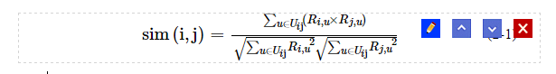
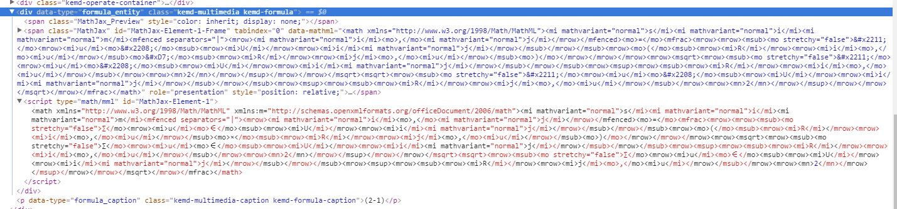

# 公式功能

## 简介

​	触发来源：工具按钮、编辑按钮

​	触发操作：插入、编辑

​	按钮功能：工具按钮（插入），编辑按钮（编辑）

​	判断是编辑还是插入：根据有无被选中的公式判断，如果有则是编辑，没有则是插入

​	注：本章只介绍公式插入流程，其他的编辑操作查看相应函数即可



## 操作(函数调用)流程

说明：按用户点击与公式相关的按钮，到最后完成功能的执行流程顺序编写

## 函数体结构

```javascript
//在编辑器iframe当中配置MathJax
var XXX
......
window.frames
    
self.clickToolbar(name, self.plugin.formula.edit);
	
self.plugin.formula = {
    edit : function(formulaKnode){
      self.plugin.formulaDialog({
        formula : formulaKnode
      });
    }  
}

//创建公式模态框
self.plugin.formulaDialog = function(options){XXX}
```

## 用户点击工具按钮

#### 操作情况：

​	用户点工具按钮，是执行插入

#### 代码流程：

```javascript
self.clickToolbar(name, self.plugin.formula.edit);
         
self.plugin.formula = {
  	//formulaKnode判断当前是工具条触发、还是编辑按钮
  	edit : function(formulaKnode) {
      	self.plugin.formulaDialog({
        	formula : formulaKnode
      	});
    }
}
```
## 用户点击编辑按钮

#### 操作情况

​	用户点击编辑按钮，是执行编辑

​	编辑按钮：通过bindEventToKeNodes函数给公式编辑按钮绑定事件，使得点击编辑按钮执行

#### 代码流程：

```javascript
多媒体工具条绑定事件函数里：fn(K(node));
点击多媒体工具条的时候调用self.plugin.formula.edit(formulaKnode);传入获取的formulaKnode
```
## 创建(弹出)模态框

```javascript
self.plugin.formulaDialog = function(options){
    var formula = options.formula;
    var html = [] //模态框界面html
    var dialog = self.createDialog({//创建模态框
        body : html,
        yesBtn : {XXX} //确认按钮
     });
  
   	 //数据回显：如果是编辑，模态框弹出，需要将数据填充到模态框当中
      if (formula && formula.attr("data-type") == "formula_entity") {//编辑按钮执行
          //获取mathml代码，！这一块对于匹配script标签有没有必要，还没决定，先正常匹配着
      	  var match = formula.html().replace(/\n/g, "").match(/<script .*<\/script>/g);
          if (match) {
           	  XXX
          } else {
			  XXX
      	  }
          //填充数据到模态框内
          mathjaxBox.val(mathjaxContent);
      	  mathShowBox.html(mathjaxContent);//现在没有这个公式显示框了
      }
  
      mathjaxBox.change(function(){XXXX}//之前有在模态框输入公式代码就渲染相应公式结果的功能，现在没有了，可以不用看
}
```


浏览器渲染的公式代码



## 确认按钮：

#### 操作情况：

​	插入：执行公式上传，按数据结构规则插入公式到编辑区
​	编辑：如果公式地址改变了，执行和插入一样的过程，公式地址未改变，只更新标题

```javascript
 yesBtn ： {
      	click : function(e) {
          	if (formula) {//如果公式存在，修改公式内容
                ......
				return;
            }
            else {
              //公式不存在，插入新公式
              var formulaCtn = 'XXXX';
              var formulaNode = K(formulaCtn);
              
              self.plugin.addMultimediaOptCtn(formulaNode);//添加工具
              self.plugin.addClassToMultimedia(formulaNode);//添加类
              self.plugin.bindEventToMultiMedia(formulaNode, self.plugin.formula.edit); //绑定事件
              self.plugin.insertContentInNewLine(formulaNode);//再新的一段插入
              self.setMultimediaTitle("formula"); //给公式重新编号
            }
          	//重新渲染公式
          	window.frames[0].updateMathJax();
          	
        }
 }
```
