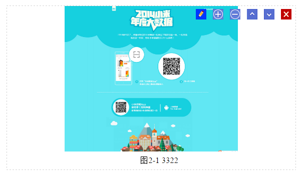
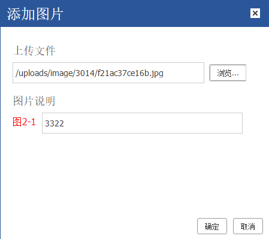

# 图片功能

## 简介

​	触发来源：工具按钮、编辑按钮

​	触发操作：插入、编辑

​	按钮功能：工具按钮（插入、编辑），编辑按钮（编辑）

​	判断是编辑还是插入：根据有无被选中的图片判断，如果有则是编辑，没有则是插入



## 操作(函数调用)流程

说明：按用户点击与图片相关的按钮，到最后完成功能的执行流程顺序编写

### 用户点击工具按钮

#### 操作情况：

​	用户选择图片，再点工具按钮，是执行编辑
​	用户未选择图片，再点工具按钮，是执行插入

#### 代码流程：

```javascript
self.clickToolbar(name, self.plugin.image.edit);
self.plugin.image = {
  	var img = null;
  	//imageKnode存在是编辑按钮触发，不存在是工具按钮
	edit : function(imageKnode) {  
    	if (imageKnode && imageKnode.name === 'img') {
    		img = imageKnode;
  		} else {
    		img = self.plugin.getSelectedImage();//执行
  		}//此处给img赋值的目的是用img来判断当前进行的是插入还是编辑，它是在imageDialog当中使用
      	self.plugin.imageDialog({xxx});//弹出模态框
    }
}

//判断有无被选中的图片
self.plugin.getSelectedImage = function() {
	return _getImageFromRange(self.edit.cmd.range, function(img) {
		return !/^ke-\w+$/i.test(img[0].className);
	});
};

```
### 用户点击编辑按钮

#### 操作情况

​	用户点击编辑按钮，是执行编辑

​	编辑按钮：通过bindEventToKeNodes函数给图片编辑按钮绑定事件，使得点击编辑按钮执行

#### 代码流程：

```javascript
self.plugin.image.edit(imageKnode);传入获取的imageKnode
edit : function(imageKnode) {
	if (imageKnode && imageKnode.name === 'img') {
		img = imageKnode;//执行
	} else {
		img = self.plugin.getSelectedImage();
	}
}
```
### 创建(弹出)模态框

```javascript
self.plugin.imageDialog = function(options) { //options是由前边操作传入的配置参数
    var img = options.image,//前边传入的imageKnode
      	imageUrl = options.imageUrl,
      	clickFn = options.clickFn;
    var html = [] //模态框界面html
    var dialog = self.createDialog({//创建模态框
        body : html,
        yesBtn : {XXX} //确认按钮
     });
  
   	 //数据回显：如果是编辑，弹出框弹出，需要将数据填充到弹出框当中
     var localUrlBox = K('[name="localUrl"]', div),
        titleBox = K('.tab2 [name="title"]', div),
		serialNumberBox = K('[name="serialNumber"]', div)
     if (!/default_image.jpg/.test(imageUrl)) {
		 localUrlBox.val(imageUrl);
     }
 	 if (img) {
      	  var titleHtml = self.plugin.getMultimediaCpt(img).html(); 
      	  var title = self.plugin.splitMultimediaCpt(titleHtml, "image");
      	  serialNumberBox[0].innerHTML = title[0] ? title[0] : '';
      	  titleBox[0].value = title[1] ? title[1] : ''; 
      }
}
```



### 确认按钮：

#### 操作情况：

​	插入：执行图片上传，按数据结构规则插入图片到编辑区
​	编辑：如果图片地址改变了，执行和插入一样的过程，图片地址未改变，只更新标题

```javascript
 yesBtn ： {
      	click : function(e) {
          	if (showLocal && showRemote && tabs && tabs.selectedIndex === 1 || !showRemote) {
            	//图片不存在或图片存在但url地址改变了，就需要执行上传图片
              	if (!img || url !== imageUrl) {
                 	uploadbutton.submit();
                	return;
                }
              	//图片存在，url地址未改变，只更新标题
                var ptitle = self.plugin.getMultimediaCpt(img);
            	ptitle.html(title);
				return;
            }
        }
 }
```

### 图片上传

```javascript
kindeditor定义了执行图片上传的api：K.uploadbutton
	var uploadbutton = K.uploadbutton({
      	//图片上传服务器之后（成功或失败）
    	afterUpload : function(data) {
          	//图片上传成功之后，做处理
        	if (data.error === 0) {
            	if (!fillDescAfterUploadImage) {
                  	//clickFn = options.clickFn; 由配置参数传入
                  	clickFn.call(self, url, title, width, height, data.border, data.align);
                }
            }
        }
    });
```

### clickFn

```javascript
self.plugin.imageDialog = function(options) {
      	//图片上传成功之后处理函数
  		clickFn : function(url, title, width, height, border, align) {
        	if (!img) {	//图片不存在，是插入
              	//判断光标当前所在的位置，需要光标在body下才能插入图片
            	if(K(ec).name === 'body'){ //如果光标在body下面，直接插入
                } else {
                  	//如果光标不在body下面，需要将光标移到body下
                	if(parents.name == "body"){
                      ......
                    } else {
                      ......
                    }
                    range.setStartAfter(outParent);
             		range.setEndAfter(outParent);
                    //所有图片：更新节点编号，重新添加class，重新绑定事件
                    self.plugin.addMultimediaOptCtn(imageNode);//添加工具
              	    self.plugin.addClassToMultimedia(imageNode);//添加类
              	    self.plugin.bindEventToMultiMedia(imageNode, self.plugin.image.edit); 
                }
            } else {  
              //图片存在，是编辑，更新页面的src地址
            }
	}
```

### 图片删除

```javascript
self.plugin.image = {
	delete
}
```