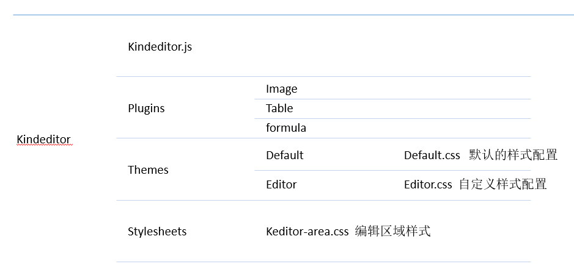
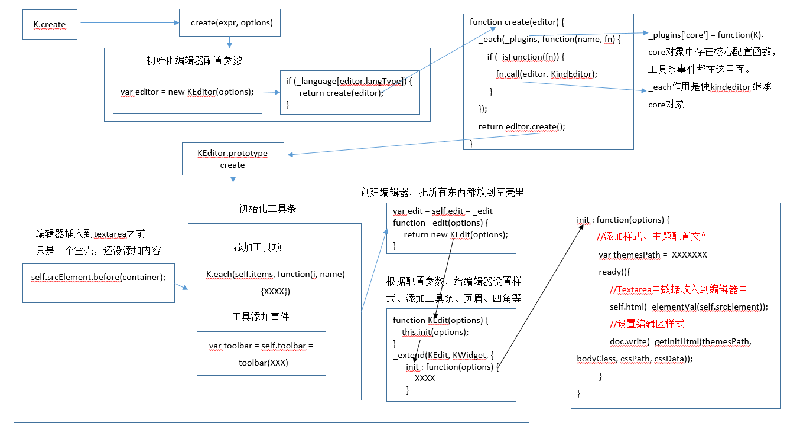

# 总体结构

## GEM结构



## 函数调用栈

​	在进行二次开发之前请仔细阅读kindeditor帮助文档：http://kindeditor.net/docs/usage.html

​	说明：以下流程图是创建编辑器的调用栈，函数是流程处理的关键函数，可在具体函数位置设置断点，来查看编辑器创建的具体过程。执行以下流程之后可对编辑器从整体上有所了解。我们二次开发就在流程当中的处理函数当中。



编辑器创建核心函数

```javascript
K.create//执行完这个函数就完成了编辑器的创建和初始化
_create(expr, options) {
  ......
  //加载default.css和editor.css
  if (_undef(options.loadStyleMode, K.options.loadStyleMode)) {
		var themeType = _undef(options.themeType, K.options.themeType);
		_loadStyle(options.themesPath + 'default/default.css');
		_loadStyle(options.themesPath + themeType + '/' + themeType + '.css');
	}
  function create(editor) {
		_each(_plugins, function(name, fn) {
			if (_isFunction(fn)) {
				fn.call(editor, KindEditor);
			}
		});
		return editor.create();
  }
  ......
  var editor = new KEditor(options);//初始化编辑器配置参数
  // 创建编辑器
  if (_language[editor.langType]) {
      return create(editor);
  }
  //载入语言配置文件
  _loadScript(editor.langPath + editor.langType + '.js?ver=' + encodeURIComponent(K.DEBUG ? _TIME : _VERSION), function() {
		create(editor);
	});
}
```

## 项目配置

mainbody.js文件当中配置kindeditor编辑器

```javascript
  var K = window.KindEditor;
  var options = {
    width:'100%',
    height:500,
    allowFileManager : true,
    uploadJson : "/kindeditor/upload",
    fileManagerJson : "/kindeditor/filemanager",
    themeType : 'editor',//配置要使用的主题文件
    items : ['editor_save', ....'auto_layout'],//配置工具条工具项目
    afterCreate : function() {
      .......
      //避免body当中出现没有节点的情况
      if (body.childNodes.length == 0) {
        var p = K('<p><br/></p>'); 
        body.appendChild(p[0]);
        range.selectNodeContents(p[0]);
        cmd.select();
        cmd.select();
      }
	  //给所有节点添加class
      kindeditor.addClassToKeNodes();
      //给多媒体工具条按钮绑定事件
      kindeditor.bindEventToKeNodes();
      //添加页眉和页脚，目前没有页脚
      updateHeaderAndFooter();
	  //隐藏加载蒙版
      setTimeout("document.getElementById('mask-loading').className = 'mask-loader-none'", 500);
    },
    //随编辑器内容改变修改编辑器高度
    afterChange : function() {
      var doc = kindeditor.edit.cmd.doc;
      var iframe = document.getElementById("editIframe");
      var iframeHeight = K(iframe).height();
      var scrollHeight = doc.body.scrollHeight;
      if(parseFloat(iframeHeight) < parseFloat(scrollHeight)){
        K(iframe).height(scrollHeight);
      }else{
        return;
      }
    },
    afterBlur: function() {
      this.sync();
    }
  };
  var kindeditor = K.create("#kindeditor-content",options);
```

编辑器加载完之后要执行的自定义内容：

```javascript
self.afterCreate(function() {
    var childs = self.cmd.doc.body.childNodes;
    var result = alterToNbsp(childs); 
    self.html(result);
    //设置元数据
    self.setDataMeta();
    //替换行内公式
    self.setInLineFormula();
    //更新所有多媒体标题
    self.setMultimediaTitle(null);
});
```
## 编辑区样式结构

```
ke-container
  ke-toolbar 
  ke-edit
    ke-edit-iframe
    ke-edit-area
  ke-statusbar
```
## iframe跨域请求

参考文档：http://www.cnblogs.com/znsongshu/p/6079495.html

​		   http://www.cnblogs.com/znsongshu/p/6079964.html