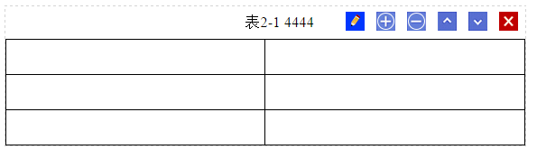
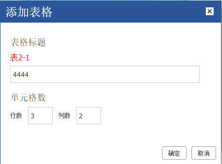

# 表格功能

## 简介

​	触发来源：工具按钮、编辑按钮、右击表格属性

​	触发操作：插入、编辑

​	按钮功能：工具按钮（插入、编辑），编辑按钮、表格属性（编辑）

​	判断是编辑还是插入：根据有无被选中的表格判断，如果有则是编辑，没有则是插入

​	注：本章只介绍表格插入流程，其他的编辑操作查看相应函数即可



## 操作(函数调用)流程

说明：按用户点击与表格相关的按钮，到最后完成功能的执行流程顺序编写

## 函数体结构

```javascript
	self.clickToolbar(name, self.plugin.table.prop);
	function _getCellIndex(table, row, cell)//取得下一行cell的index
	
	self.plugin.table = {
      	prop : function(isInsert, tableKnode) 
		cellprop : function() 
		
		'delete' : function()
          
		colinsertleft : function() 
		colinsertright : function() 
          
		rowinsertabove : function() 
		rowinsertbelow : function() 
          
        coldelete : function() 
		rowdelete : function() 
    }

```

## 表格右键菜单

```javascript
_each(('prop,colinsertleft,colinsertright,rowinsertabove,rowinsertbelow,coldelete,rowdelete').split(','), function(i, val) {
		self.addContextmenu({
			title : self.lang('table' + val),
			click : function() {
				self.loadPlugin('table', function() {
					self.plugin.table[val]();
					self.hideMenu();
				});
			},
			width : 170,
			iconClass : 'ke-icon-table' + val
		});
	});
```

## 用户点击工具按钮、表格属性

#### 操作情况：

​	用户选择表格，再点工具按钮，是执行编辑

​	用户未选择表格，再点工具按钮，是执行插入

​	表格属性直接编辑

#### 代码流程：

```javascript
self.clickToolbar(name, self.plugin.table.prop);
         
self.plugin.table = {
  	//tableKnode判断当前是工具条触发、还是编辑按钮
  	//isInsert是插件库原有变量，编辑按钮、工具按钮触发时都将其设成了false，在这里不用关心
  	prop : function(isInsert, tableKnode) {
      	self.createDialog({xxx});//弹出模态框
    }
}
```
## 用户点击编辑按钮

#### 操作情况

​	用户点击编辑按钮，是执行编辑

​	编辑按钮：通过bindEventToKeNodes函数给表格编辑按钮绑定事件，使得点击编辑按钮执行

#### 代码流程：

```javascript
多媒体工具条绑定事件函数里：fn(false, K(node));
点击多媒体工具条的时候调用self.plugin.table.prop(false,tableKnode);传入获取的tableKnode
```
## 创建(弹出)模态框

```javascript
prop : function(isInsert, tableKnode) {
    var html = [] //模态框界面html
    var dialog = self.createDialog({//创建模态框
        body : html,
        yesBtn : {XXX} //确认按钮
     });
  
   	 //数据回显：如果是编辑，弹出框弹出，需要将数据填充到弹出框当中
  	  var table;
  	  if (tableKnode && tableKnode.name === 'table') {//编辑按钮执行
        table = tableKnode;
      } else {//工具按钮、表格属性执行
		table = self.plugin.getSelectedTable();
      }
  	  //table存在，填充数据
  	  if (table) {
        ......
        //分割标号和标题内容，如表4-1 XXXXX
         var title = self.plugin.splitMultimediaCpt(titleHtml, "table");
        ......
      }
}

//获取当前光标所在位置的表格
self.plugin.getSelectedTable = function() {
	return self.cmd.commonAncestor('table');
};
```



## 确认按钮：

#### 操作情况：

​	插入：执行表格上传，按数据结构规则插入表格到编辑区
​	编辑：如果表格地址改变了，执行和插入一样的过程，表格地址未改变，只更新标题

```javascript
 yesBtn ： {
      	click : function(e) {
          	if (table) {//修改表格标题
              	......
				return;
            }
          	//表格不存在，插入新表格
          	var html = '<div data-type="table" data-meta="html" contenteditable="false"><p data-type="table_caption">'+ "表1-1 " + tablecaption + ' </p><table data-type="table_entity" width="100%" contenteditable="true"';
			html += '>';
          	......
            var tableNode = K(html);
          	self.plugin.addMultimediaOptCtn(tableNode);//添加工具
            self.plugin.addClassToMultimedia(tableNode);//添加类
            self.plugin.bindEventToMultiMedia(tableNode, self.plugin.table.prop); //绑定事件
            self.plugin.insertContentInNewLine(tableNode);//再新的一段插入
            self.setMultimediaTitle("table"); //给表格重新编号
        }
 }
```
