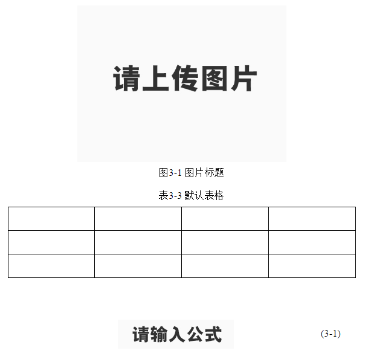

# 辅助工具

## 简介

​	辅助工具函数实现的功能是基于编辑区数据结构执行，查看函数具体执行过程之前请结合具体节点的数据结构。

​	辅助工具函数作为独立的执行单元，可在需要的地方直接调用

​	注：通过阅读本文档知道有哪些辅助工具函数，具体逻辑请到插件当中详细阅读

​		本章虽然展现了很多代码，但逻辑非常简单

## 多媒体节点操作

### 获取所有多媒体节点

```javascript
  getAllKemdNodes : function() {
    ......
  }
```

### 添加多媒体工具条

```javascript
self.plugin.kemdClass = { XXXX } //多媒体节点用到的所有类
self.plugin.kemdClassName = { XXXX } //由kemdClass组合成每一个节点需要的类
self.plugin.multimediaOperateCtn = '' //多媒体工具条
self.plugin.addMultimediaOptCtn = function(mediaCtnNode) //将工具条插入到多媒体节点中
```

## 多媒体class

### 文本、多媒体统一添加class

```javascript
/*
* 编辑区正文文本、多媒体节点添加class，参照数据协议即可查看到该函数执行后的结果
*/ 
addClassToKeNodes : function() {
   ......
   if (titleIndex != -1) {
      //文本节点添加标题class
      K(childs[i]).addClass(titleArr[titleIndex + 1]); 
    } else if (mediaIndex != -1) {
      //多媒体节点添加编辑区
      self.plugin.addMultimediaOptCtn(K(childs[i]));
      //多媒体节点以及所有子节点添加class
      self.plugin.addClassToMultimedia(K(childs[i]));
    }
}
```

### 单个多媒体节点添加class

```javascript
//多媒体节点以及所有子节点添加class  
self.plugin.addClassToMultimedia = function(mediaCtnNode) {
  	......
}
```

## 多媒体事件

### 多媒体节点绑定事件

```javascript
 bindEventToKeNodes : function() {
    var self = this;
    var mediaEditNodes = self.getAllKemdNodes();  

    //查找指定类型多媒体节点，给操作区的功能按钮添加事件
    function bindEventByKemdType(name, val) {
      for (var i=0; i<mediaEditNodes.length; i++) {
        var dataType = K(mediaEditNodes[i]).attr("data-type");
        var fn = self.plugin[name][val];//需要在插件加载完之后才能调用这个函数

        if (dataType === name) {
          //多媒体操作区功能按钮添加事件
          self.plugin.bindEventToMultiMedia(K(mediaEditNodes[i]), fn);
        }
      }
    }
    
	//一般插件加载是通过点击工具条来加载的，在这里绑定事件需要用到调用插件，如self.plugin['image']['edit']的函数，这些函数是插件加载完才有，所以需要在绑定事件之前先加载插件
    self.loadPlugin('image', function() {
      bindEventByKemdType('image', 'edit');
    });

    self.loadPlugin('formula', function() {
      bindEventByKemdType('formula', 'edit');
    });

    self.loadPlugin('table', function() {
      bindEventByKemdType('table', 'prop');
    });
 }
```

### 多媒体工具条每一个按钮添加事件

```javascript
  self.plugin.bindEventToMultiMedia = function(mediaNode, fn) {
    ......
  }
```

## 多媒体编号和默认内容

### 多媒体节点自动编号

```javascript
/*
 * mediaType存在就只更新特定多媒体编号，如果不存在就更新所有多媒体编号
 */
setMultimediaTitle : function(mediaType) {
	var self = this;
    var kemdNodes = self.getAllKemdNodes();
    var count = {image : 0, formula : 0, table : 0};

    for (var i=0; i<kemdNodes.length; i++) {
      var dataType = K(kemdNodes[i]).attr("data-type");
      count[dataType]++;
      //判断是更新所有的还是特定的
      if (!mediaType || mediaType == dataType) {
        _addTitleToMultimedia(kemdNodes[i], dataType, count[dataType]);
      }
    }
  }

/*
 * 查找多媒体节点的标题子节点，编号标题
 */
function _addTitleToMultimedia(parentNode, dataType, number) {
  var children = parentNode.children;
  //getChapterNumber写在父域中，通过parent调用
  var chapterNumber = parent.getChapterNumber();
  //正则匹配：图11-11 XXXX、图1.1 XXXX、图1．1 XXXX,每一个之间都有可能出现空格，表格也是这个。
  //或语法：(?:XX|XX)，此处的()不是正则表达式的()
  var graphic1 = /([图表])(?:&nbsp;|\s)*\d{1,2}(?:&nbsp;|\s)*[-\.．](?:&nbsp;|\s)*\d{0,2}(?:&nbsp;|\s)*(.{0,25})/;
  //图 1 XXXX
  var graphic2 = /([图表])(?:&nbsp;|\s)*\d{1,2}(?:&nbsp;|\s)*(.{0,25})/;
  //(公式 1-1)、(公式 1.1)、(公式 1．1). 公式也可以没有，括号可以是中英文
  var formulaReg = /[\(（](?:&nbsp;|\s)*(公式)?(?:&nbsp;|\s)*\d{1,2}(?:&nbsp;|\s)*[-\.．](?:&nbsp;|\s)*\d{0,2}(?:&nbsp;|\s)*[\)）]/;
  var html = "";

  //遍历所有子节点，去查找标题节点
  for (var j=0; j< children.length; j++) {

    if (K(children[j]).attr("data-type") == dataType+"_caption") {
      var title = children[j].innerHTML.trim();

      if (graphic1.test(title) || graphic2.test(title)) {//匹配表格图片标题
        var type = RegExp.$1; 
        var content = RegExp.$2;
        html = type + chapterNumber + '-' + number + ' ' + content;
      }
      else if (formulaReg.test(title)) {//匹配公式标题
        html = "(" + chapterNumber + "-" + number + ")";
      }

      children[j].innerHTML = html;
    }
  }
}
```

### 多媒体默认内容设置

只有多媒体标题，没有内容，设置默认的内容

如：“图1-1 图片标题”，通过智能排版识别出来出来后，需要给它设置一个默认的图片，来标明这个地方是图片



```javascript
例：_wrapMultimediaDiv(self, "图1-1 图片标题", "图")

function _wrapMultimediaDiv(object, multimediaHtml, mediaZh) {
  var self = object;
  var html = '',//默认内容html代码
      dataFormula = '',//使用data-formula = -1来区分正常公式与默认公式图片
      dataMeta = '',//设置图片类型 
      width = 'width = "60%';//图片默认宽度60%
  var mediaHash = {
    "图" : "image",
    "表" : "table",
    "公式" : "formula"
  };
  var dataType = mediaHash[mediaZh];
  multimediaHtml = multimediaHtml.trim();
  if (mediaZh == "表") {//表格执行这个
    dataMeta = "html";
    //生成默认表格html代码
    html = '<p data-type="table_caption">'+ multimediaHtml + '</p><table data-type="table_entity" width="100%" contenteditable="true">'; 
	for (var i = 0; i < 3; i++) {
		html += '<tr>';
		for (var j = 0; j < 4; j++) {
			html += '<td><p>' + (K.IE ? '&nbsp;' : '<br />') + '</p></td>';
		}
		html += '</tr>';
	}
	html += '</table>';
  } else {//公式或图片执行这个
    if (mediaZh == "公式") {
      dataFormula = "data-formula = '-1'";//设置其为-1用来标识是默认的公式图片
      width = '';
    }

    dataMeta = "image_com";
    //生成默认图片或默认公式图片html代码
    html = ''; 
  }

  var result = '<div data-type="'+dataType+'" data-meta="'+dataMeta+'" contenteditable="false">'+html+'</div><p><br/></p>';

  return result;
}
```

## Visio图处理

非IE浏览器不能正常显示visio格式的图片，我们将这类图片统一使用默认图片替换显示。这样的visio图存在于行内公式图片，段落图片

### 行内公式visio图片

行内公式图片存在于文本节点中，是visio（wmf、emf）格式的图片，在IE下面正常显示，非IE下面替换成默认图片显示，

data-src存储的是图片的原本地址，我们更改的只是src，data-src不会改变

```javascript
  setInLineFormula : function() {
	var self = this;
    //查找body下面所有文本节点内的图片节点
    var images = _queryAll('p img, h1 img, h2 img, h3 img, h4 img', self.cmd.doc.body);
    for (var i=0; i<images.length; i++) {
      var dataSrc = K(images[i]).attr("data-src");//取得图片原地址
      var src = "";
      //判断是不是visio格式的图片
      if (/\.[ew]mf/.test(dataSrc)){
        if (_IE || _NEWIE) {//IE下面正常显示，src设置为原地址
          src = K(images[i]).attr("data-src");
        } else {//非IE下面使用默认行内公式图片
          src = self.themesPath +'/default/default/default_lineformula.png';
        }
        //更改图片src，也要同时修改data-ke-src，否则图片不显示
        K(images[i]).attr("src", src);
        K(images[i]).attr("data-ke-src", src);
      }
    }
  }

```
### 段落visio图片显示

通过data-meta属性"image_win"来识别是不是visio图片。

注：因为data-meta是后来加入的，这个函数之前是用来处理给所有未添加data-meta属性的多媒体节点添加data-meta的，后来需要替换visio图就将替换的逻辑写在了这里

```javascript
  setDataMeta : function() {
	var self = this;
    var kemdNodes = self.getAllKemdNodes();
    for (var i=0; i<kemdNodes.length; i++) {
      var knode = K(kemdNodes[i]);
      var dataType = knode.attr("data-type");
      var dataMeta = knode.attr("data-meta");
      
      if (dataMeta) {
        //替换win格式图片
        if (dataMeta == "image_win") {
          //查找子节点img，执行替换
          knode.scan(function(child) {//scan是查找所有子节点
            if (child.nodeName == "IMG") {
              var src = "";
              if (_IE || _NEWIE) {//IE下正常显示图片,使用图片原地址
                src = K(child).attr("data-src");
              } else {//非IE使用默认图片替换
                if (dataType == "formula") {//visio格式的公式图片
                  src = self.themesPath +'/default/default/default_formulawin.jpg';
                } else {
                  src = self.themesPath +'/default/default/default_win.jpg';
                }
              }
              //不改变这个属性，图片就无法显示
              K(child).attr("src", src); 
              K(child).attr("data-ke-src", src); 
            }
          });
        }
      }
      //兼容没添加data-meta属性的情况，设置其data-meta，
      else {
        if (dataType == "image") {
          //visio图是后来才引入的，在此之前的论文图片都是非visio格式的，所以我们都将其设为image_com
          knode.attr("data-meta", "image_com");	
          knode.scan(function(child) {
            if (child.nodeName == "IMG") {
              var src = K(child).attr("src");
              K(child).attr("data-src", src);
            }
          });
        }
        else if (dataType == "table") {
          knode.attr("data-meta", "html");
        }
        else if (dataType == "formula") {
          knode.attr("data-meta", "mathml");
        }
      }
    }
  }
};
```